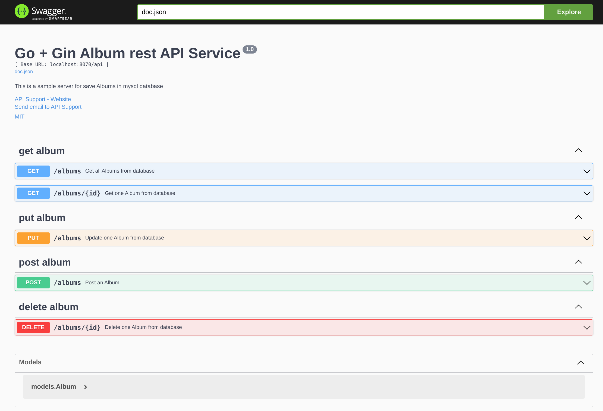

# album

Implementation of a rest api named album with the help of gin framework



## usage
### Note: 
    - Before running the api, first customize the .env file.
    - In this project, two Dockerfiles are defined, one of which is for multi stage.
```bash
# Build image
docker build -t album:latest .

# Use image by docker-compose.
docker-compose up -d

# For down docker-compose.
docker-compose down -v

# For show logs
docker-compose logs -f

# Run rest api without docker
go run main.go
```