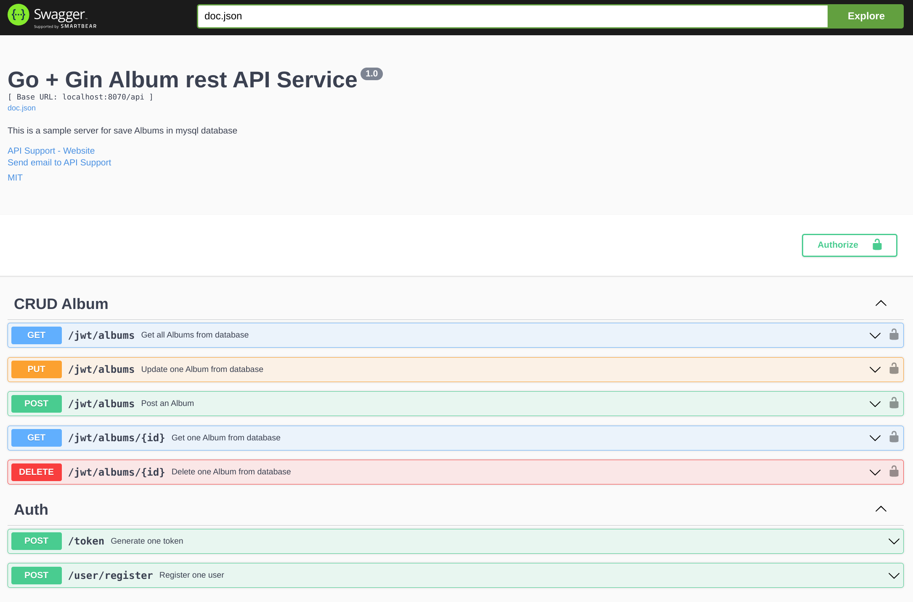

# album

Implementation of a rest api named album with the help of gin framework




### Note: 
    - Before running the api, first customize the .env file.
    - In this project, two Dockerfiles are defined, one of which is for multi stage.
## usage:
```bash
# Build images
docker build -t album:latest ./dockerfile/album-dockerfile
docker build -t my-mysql:8.0 ./dockerfile/mysql-dockerfile

# Use image by docker-compose.
docker-compose up -d

# For down docker-compose.
docker-compose down -v

# For show logs
docker-compose logs -f
```
- Run album REST API without docker
    - First install mysql using [here](https://dev.mysql.com/doc/refman/8.0/en/linux-installation.html)
    - go run main.go

- Run Unit Test for this project
```bash
go test -v -cover ./unitTest/
```

- For access Swagger page
click [here](http://localhost:8070/api/docs/index.html)
